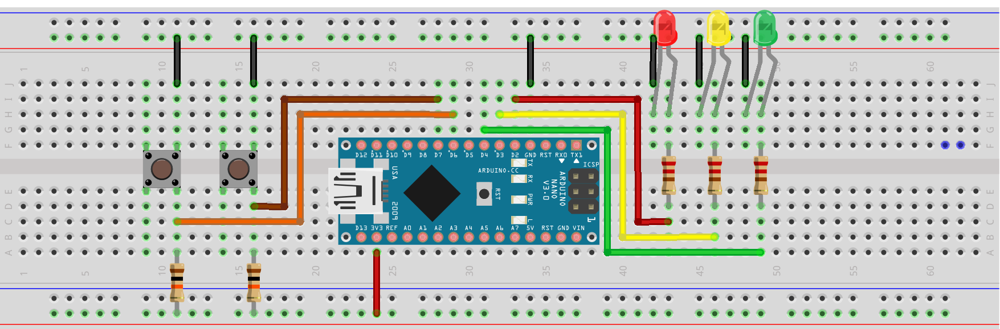

# Semáforo 
## Secuencia de semáforo
Secuencia de semáforo haciendo uso de máquinas de estado

Se hace uso de una máquina de estados para controlar el antirebote de los pulsantes.
- El programa cuenta con su respectiva modularización, es decir, los archivos
- - teclas.cpp
  - teclas.h
  - semaforo.cpp
  - semaforo.h
## SemaforoD Descripción

## PdM Descripción
- En la carpeta PdM se encuentra la versión generada por Luis, que ocupa un arduino nano, (para que se tenga en consideración). 
- Aquí se encuentra implementada una versión de
  - teclas.cpp
  - teclas.h
  - semaforo.cpp
  - semaforo.h
- Dentro del main.cpp se ha generado una prueba para el semáforo, llamando las funciones para que lea el pulsante como también para que funcione el semáforo.
- Se encuentra también el circuito que se usó, que se puede apreciar en Esquema_Semaforo.png.

